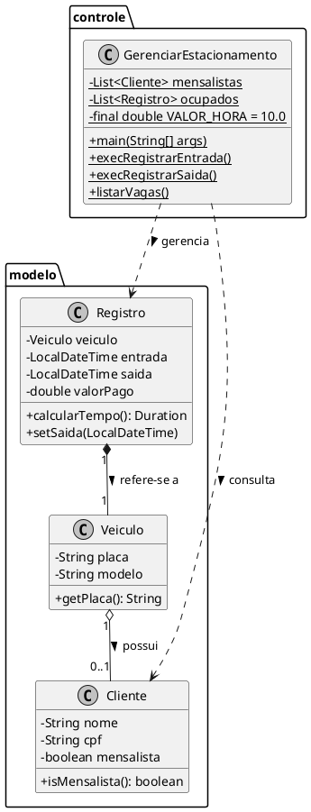

Este é um excelente exercício para consolidar os fundamentos de **Programação Orientada a Objetos (POO)**, manipulação de datas e coleções em Java.

Abaixo, o roteiro de um **Laboratório de Desenvolvimento** estruturado para ser executado passo a passo, focando na lógica e na arquitetura, sem entregar o código pronto.

---

# 🛠️ Laboratório: Sistema de Gestão de Estacionamento (Console Java)

## 📋 Contexto
Você foi contratado para desenvolver o motor lógico de um totem de autoatendimento para um estacionamento. O sistema deve diferenciar clientes que já possuem cadastro (Mensalistas) de clientes que entram de forma avulsa.

---

## 🏗️ Passo 1: Definição do Modelo de Dados (Classes)
Crie um pacote chamado `modelo` e implemente as seguintes classes:

1.  **Classe `Veiculo`**: Deve conter `placa` (String) e `modelo` (String).
2.  **Classe `Cliente`**: Deve conter `nome`, `cpf` e um booleano `isMensalista`. 
    * *Dica:* Um `Veiculo` pode ter um atributo `Cliente dono` (opcional).
3.  **Classe `Vaga`**: Deve conter `numero` (int) e um booleano `disponivel`.
4.  **Classe `Registro`**: Esta é a classe principal de movimentação. Ela deve associar:
    * Um `Veiculo`.
    * A `Vaga` ocupada.
    * `LocalDateTime entrada` e `LocalDateTime saida`.

---

## 🚦 Passo 2: A Classe de Gerenciamento
Crie a classe `GerenciarEstacionamento` no pacote principal. Esta classe será o "cérebro" do aplicativo.

1.  **Atributos Globais (Static)**:
    * Uma `List<Registro>` para armazenar os veículos que estão atualmente no estacionamento.
    * Uma `List<Cliente>` para simular um banco de dados de clientes mensalistas já cadastrados.
    * Um `Scanner` global para capturar entradas do usuário.
    * Uma constante `VALOR_HORA = 10.0`.

2.  **O Método `main`**:
    * Deve exibir um menu textual (Ex: `1-Entrada, 2-Saída, 3-Status, 0-Sair`).
    * Utilize um laço `while` e uma estrutura `switch-case` para chamar os métodos auxiliares.

---

## 📥 Passo 3: Implementando a Entrada (`execRegistrarEntrada`)
Ao selecionar esta opção, o sistema deve:
1.  Pedir a placa do veículo.
2.  **Verificação de Mensalista:** Percorrer a lista de clientes cadastrados. Se a placa informada pertencer a um carro de um mensalista, o registro deve ser marcado como tal.
3.  **Instanciação:** Criar um novo objeto `Registro`, capturando o horário atual com `LocalDateTime.now()`.
4.  **Armazenamento:** Adicionar esse registro na lista de "ocupados".

---

## 📤 Passo 4: Implementando a Saída (`execRegistrarSaida`)
Esta é a parte mais complexa da lógica:
1.  Pedir a placa do veículo que está saindo.
2.  **Localização:** Buscar na lista de "ocupados" o objeto que contém aquela placa.
3.  **Cálculo de Tempo:** Definir o horário de saída (`LocalDateTime.now()`) e calcular a diferença em relação à entrada.
    * *Dica:* Use a classe `java.time.Duration`.
4.  **Cálculo de Valor:** * Se o cliente for **Mensalista**, o valor é R$ 0,00 (considerando que ele já paga mensalmente).
    * Se for **Avulso**, multiplique as horas (ou frações) pelo `VALOR_HORA`.
5.  **Finalização:** Exibir o resumo (Tempo permanecido e Valor a pagar) e remover o registro da lista de ocupados.

---

## 📊 Passo 5: Relatório de Status (`listarVagas`)
Implemente um método que percorra a lista de ocupados e exiba de forma organizada:
* Placa do veículo.
* Hora de entrada formatada (Use `DateTimeFormatter`).
* Se é Mensalista ou Avulso.

---

## 🧪 Desafios Extras (Opcional)
* **Validação de Vagas:** Defina um limite máximo de vagas (ex: 10). Se o estacionamento estiver cheio, o método de entrada deve impedir o registro.
* **Persistência Simples:** Crie um método `popularDados()` que já inicia o programa com 2 ou 3 mensalistas cadastrados para facilitar seus testes.

Para este laboratório, a modelagem deve refletir uma estrutura de **objetos conectados**, onde o foco é a transição do estado do veículo (de "estacionado" para "liberado") e a identificação do tipo de cliente para fins de cobrança.

Abaixo está a representação visual e estrutural para guiar o seu desenvolvimento em Java:

### 1. Modelagem de Classes (PlantUML)

---

### 2. Estrutura de Atributos e Métodos

Para realizar a atividade no console, foque nestes detalhes técnicos de cada classe:

#### **Classe Veiculo**
* **Papel:** Armazenar os dados básicos do carro.
* **Dica:** No construtor, você pode receber apenas a placa se for um cliente avulso.

#### **Classe Cliente**
* **Papel:** Diferenciar quem paga mensalidade de quem paga por hora.
* **Lógica:** O atributo `mensalista` (boolean) será o "divisor de águas" no seu método de cálculo de valor.

#### **Classe Registro**
* **Papel:** Representar o "ticket" do estacionamento.
* **Atributos de Tempo:** Use `java.time.LocalDateTime` para os atributos `entrada` e `saida`.
* **Método `calcularTempo()`:** Dentro deste método, utilize:
    $$Duration.between(entrada, saida)$$
    Isso facilitará muito a obtenção do total de minutos ou horas para a cobrança.

#### **Classe GerenciarEstacionamento (A Fachada/Console)**
* **Scanner:** Declare como `private static Scanner leitor = new Scanner(System.in);` para usar em todos os métodos sem precisar instanciar novamente.
* **Listas:** Use `ArrayList<>` para as coleções de `mensalistas` e `ocupados`.
* **Menu:** Utilize um bloco `do-while` para manter o programa rodando até que o usuário digite "0".

---

### 3. Fluxo Lógico sugerido para o `execRegistrarSaida`

Este é o ponto onde a maioria dos alunos se confunde. Siga esta ordem:
1.  Peça a placa via `scanner.nextLine()`.
2.  Use um laço (`for` ou `stream`) para encontrar o `Registro` na lista de `ocupados` que tenha aquela placa.
3.  Se encontrar:
    * Atribua `LocalDateTime.now()` à `saida`.
    * Verifique se o veículo pertence a um `Cliente` da lista de mensalistas.
    * Aplique a regra de negócio: **Se mensalista -> Valor 0 | Se avulso -> Horas x VALOR_HORA**.
    * Remova o registro da lista de `ocupados`.
4.  Se não encontrar, exiba "Veículo não encontrado".

